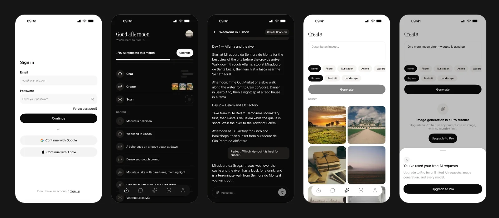

<p align="center">
  <a href="https://www.native.express/?utm_source=github&utm_medium=readme&utm_campaign=react-native-boilerplate"></a>
</p>

<h1 align="center">NativeExpress: a React Native boilerplate with sign-in, subscriptions and AI already working</h1>

<p align="center">
  
  
  
  
  
</p>

<p align="center">
  <a href="https://www.native.express/?utm_source=github&utm_medium=readme&utm_campaign=react-native-boilerplate#pricing"><b>Get NativeExpress</b></a> ·
  <a href="https://docs.native.express">Documentation</a> ·
  <a href="https://www.native.express/changelog">Changelog</a> ·
  <a href="#faq">FAQ</a>
</p>

NativeExpress is a paid React Native boilerplate for iOS and Android, built on Expo SDK 57, React Native 0.86 and TypeScript. It is a complete app you own as source code: Apple, Google and email sign-in on Supabase, RevenueCat subscriptions with Superwall paywalls, AI chat, image generation and camera scan, push notifications, analytics and crash reporting. A licence costs $229 once and includes every future version. The current release is 2.1.1, published on 2 October 2026.

> **This repository is the public overview.** The source code is in a private repository that you get access to after [buying a licence](https://www.native.express/?utm_source=github&utm_medium=readme&utm_campaign=react-native-boilerplate#pricing).

<p align="center">
  <a href="https://www.native.express/?utm_source=github&utm_medium=readme&utm_campaign=react-native-boilerplate"></a>
</p>

## What the React Native starter kit includes

Every part below is wired to the others and runs on the first build. Chat, image generation and scan are separate modules under `src/features/`, so you can keep any combination or none.

**Accounts and data**
- Apple, Google and email sign-in on Supabase Auth, including password reset by deep link
- Postgres you own: every table, policy and storage bucket ships as a migration
- Row Level Security, tested against a real database in CI

**Subscriptions**
- RevenueCat for in-app purchases and subscription management
- Superwall for paywalls you can redesign and A/B test without shipping a release
- Server-verified entitlements: the edge functions ask RevenueCat who is Pro before they spend your AI budget

**AI features**
- Chat that streams from your own Supabase edge functions, with photo attachments
- Image generation with style presets and aspect ratios
- Camera scan that returns a structured result
- GPT, Claude and Gemini through OpenRouter, switched in one config file
- No API key ships in the app, and the free quota is enforced on the server

**Interface**
- Uniwind (Tailwind CSS v4 for React Native) and HeroUI Native components
- A design system built on semantic tokens, ready to rebrand
- Light and dark mode, phone and iPad layouts, an onboarding flow

**Operations**
- OneSignal push notifications, PostHog analytics, Sentry crash reporting
- Translations with i18n
- Each integration is a swappable service you can switch off

**Agent skills and store tooling**
- A setup skill that configures every integration and verifies each step
- A design skill that themes the app
- Scripts that strip out the features and vendors you don't need
- Tooling that captures store screenshots and prepares listing metadata

## Tech stack

| Job | Library or service |
|---|---|
| Framework | Expo SDK 57, React Native 0.86, React 19.2 |
| Language | TypeScript 6.0 |
| Navigation | Expo Router, file-based |
| Styling | Uniwind (Tailwind CSS v4), HeroUI Native |
| Backend | Supabase: Postgres, Auth, Edge Functions, Storage |
| Payments | RevenueCat, Superwall |
| AI | Vercel AI SDK, OpenRouter |
| Push | OneSignal |
| Analytics and crashes | PostHog, Sentry |
| Testing | Jest, React Native Testing Library |

The [tech stack page](https://docs.native.express/tech-stack) in the docs explains why each one was chosen.

## NativeExpress and the free React Native templates

[Ignite](https://github.com/infinitered/ignite), the [Obytes starter](https://github.com/obytes/react-native-template-obytes) and Expo's default template are free, open source and well maintained. They give you project structure and tooling. NativeExpress is paid and goes further: it includes the backend, payments and store work those templates leave to you.

| | NativeExpress | Ignite | Obytes Starter | create-expo-app |
|---|---|---|---|---|
| Price | $229 once | Free | Free | Free |
| Expo SDK | 57 | 55 | 54 | Latest |
| React Native | 0.86 | 0.83 | 0.81 | Latest |
| Sign-in and backend | Supabase with Apple, Google and email | No backend | No backend | No |
| Subscriptions | RevenueCat and Superwall | No | No | No |
| AI features | Chat, image generation, scan | No | No | No |
| Push, analytics, crashes | OneSignal, PostHog, Sentry | No | No | No |
| Source | Private repository after purchase | Open source | Open source | Open source |

Versions and dependencies were read from each project's main branch on 5 October 2026.

## Start a new app from the Expo template

After purchase you get access to the private repository. Setup needs Node 22 or newer.

```bash
# Scaffold a new app
npx nativeexpress-cli create-app my-app

# From the new directory: reports what is configured and what is not
node .claude/skills/setup/scripts/doctor.mjs
```

From there, the setup skill walks your coding agent through configuration, migrations, secrets and the first build, and asks you when it needs a sign-in or a key. The [quickstart](https://docs.native.express/setup/quickstart) covers the whole path.

You need free Supabase and Expo accounts and an API key for the AI provider. To publish, you need an Apple Developer account and a Google Play developer account.

## Project structure

```text
nativeexpress/
├── src/
│   ├── app/                 # Screens, file-based routing
│   ├── components/          # UI components
│   ├── features/            # Chat, Create, Scan: each removable on its own
│   ├── hooks/               # Custom React hooks
│   ├── i18n/                # Translations
│   ├── lib/                 # Supabase client, database helpers, logger
│   ├── provider/            # Global context providers
│   ├── services/            # Swappable integrations: analytics, crash reporting, paywall, push
│   ├── theme/               # Design tokens
│   └── global.css           # Tailwind v4 theme and utilities
├── supabase/                # Migrations and edge functions
├── app.config.js            # Expo app configuration
├── config.js                # Central app configuration
├── DESIGN.md                # Design system reference
├── eas.json                 # EAS Build configuration
└── store.config.json        # App Store listing metadata
```

## What developers say

> "It makes the setup and deployment of our projects more efficient, saving us both time and money."
> **Malte Herberg, CTO at TerraOne**

> "I know how much time you can lose in all the random details. Native Express handles all that for you."
> **Shi Zai, CTO at StackAuth (YC S24)**

> "As a web developer building my first app, this boilerplate made my life so much easier."
> **Andrei Hudovich, indie maker**

> "NativeExpress was exactly what I needed, allowed me to launch a fairly complex mobile app in 3 months."
> **Matthew L., founder of PolyM**

## Pricing

One payment, no subscription. Every tier gets the same code, commercial use and every future version.

| Tier | Price | Seats | Adds |
|---|---|---|---|
| Solo | $229 | 1 | |
| Startup | $599 | Up to 5 | Client work, priority support, a 90-minute consulting call |
| Agency | $1,124 | Up to 10 | Everything in Startup, plus white-label delivery and a private Discord channel |

**[Get NativeExpress](https://www.native.express/?utm_source=github&utm_medium=readme&utm_campaign=react-native-boilerplate#pricing)**

## FAQ

### What is a React Native boilerplate?

A React Native boilerplate is a starting codebase with the parts every app needs already built: project structure, navigation, sign-in, payments, and the build and release setup. You start from a working app and replace the example features with your own.

### Is NativeExpress free or open source?

No. It is a commercial product with a one-time licence from $229. This repository is the public overview. The source code is in a private repository you get access to after purchase. If you need a free starting point, Ignite and the Obytes starter are good ones.

### What exactly do I get?

Access to the private GitHub repository with the complete React Native and Expo app, the agent skills for setup, conventions, store assets and submission, and documentation with written and video guides. Every tier gets the same code and lifetime updates.

### Do I need mobile experience?

No. It was first built for web developers: React Native works like React, Expo Router gives you file-based routing, and Uniwind lets you write Tailwind classes. You do need to be comfortable in a terminal. If you have never used one, budget an evening for the tooling first.

### Does it work with Claude Code, Cursor and Codex?

Yes. The setup and conventions skills follow the open skills format, so Claude Code, Cursor, Codex, Gemini CLI and other agents can use them. The store-assets and submit skills are Claude Code skills. The documentation is also published as Markdown that agents can read directly.

### Which is better, Expo or the React Native CLI?

For a new app, Expo. The React Native documentation recommends starting with a framework and names Expo. NativeExpress uses Expo SDK 57 with development builds, so native modules such as RevenueCat and OneSignal work, and you keep EAS Build and file-based routing. There is a [longer comparison on the blog](https://www.native.express/blog/expo-vs-react-native-cli).

### Is React Native still relevant in 2026?

Yes, if you want one TypeScript codebase for iOS and Android. React Native 0.86 runs on the New Architecture, and Expo covers builds, updates and store submission. For anyone who already knows React, it is the shortest path to a native app.

### What other costs are there?

Supabase and Expo have free tiers that cover development. AI usage is billed by your provider at their rates. Publishing needs an Apple Developer account at $99 a year and a Google Play developer account at $25 once.

### How is it kept up to date?

Dependencies and frameworks move to their latest stable versions regularly. Version 2 moved to Expo SDK 57, React Native 0.86 and Tailwind v4 through Uniwind. Earlier versions stay tagged in the repository, so a shipped app keeps building until you choose to upgrade. The [changelog](https://www.native.express/changelog) lists every release.

### Can I get a refund?

No. Once you have access to the repository the code is yours, so purchases cannot be refunded. If you are unsure, email contact@native.express before you buy.

## Links

- [native.express](https://www.native.express/?utm_source=github&utm_medium=readme&utm_campaign=react-native-boilerplate): product site and pricing
- [Documentation](https://docs.native.express): setup, every integration and store submission
- [Changelog](https://www.native.express/changelog): every release
- [Apps built with NativeExpress](https://www.native.express/apps)
- [Discord](https://discord.gg/BZDNtf8hqt): help and discussion
- [@robin_faraj](https://x.com/robin_faraj): the maintainer

## Licence

NativeExpress is commercial software. The [licence](https://www.native.express/legal/license) describes what each tier allows. The contents of this overview repository are © 2026 JRS Content Solutions UG (haftungsbeschränkt).
